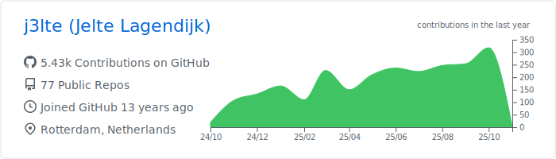

    <h2>Hi there 👋</h2> 
    I'm <b>Jelte Lagendijk</b>, a Software Engineer from The Netherlands.  
    I'm a Full Stack Developer who enjoys building reusable solutions. I'm fun to work with, enjoy coding and using creativity.
Have been doing mostly Front End development in the past, but made the transition to broader stacks since 2022. I enjoy Typescript, <a href="https://nextjs.org/" target="_blank">NextJS</a>, <a href="https://deno.com/" target="_blank">Deno</a>, Serverless technologies and Docker. Huge fan of <a href="https://raycast.com/j3lte" target="_blank">Raycast</a>, I build extensions in my free time (see below).  

  <picture>
    <source media="(prefers-color-scheme: dark)" srcset="./profile-summary-card-output/github_dark/0-profile-details.svg">
    <source media="(prefers-color-scheme: light)" srcset="./profile-summary-card-output/github/0-profile-details.svg">
    
  </picture>

 

  <picture>
    <source media="(prefers-color-scheme: dark)" srcset="./profile-summary-card-output/github_dark/1-repos-per-language.svg">
    <source media="(prefers-color-scheme: light)" srcset="./profile-summary-card-output/github/1-repos-per-language.svg">
    
  </picture>
  <picture>
    <source media="(prefers-color-scheme: dark)" srcset="./profile-summary-card-output/github_dark/2-most-commit-language.svg">
    <source media="(prefers-color-scheme: light)" srcset="./profile-summary-card-output/github/2-most-commit-language.svg">
    
  </picture>

 

  <picture>
    <source media="(prefers-color-scheme: dark)" srcset="./profile-summary-card-output/github_dark/3-stats.svg">
    <source media="(prefers-color-scheme: light)" srcset="./profile-summary-card-output/github/3-stats.svg">
    
  </picture>
  <picture>
    <source media="(prefers-color-scheme: dark)" srcset="./profile-summary-card-output/github_dark/4-productive-time.svg">
    <source media="(prefers-color-scheme: light)" srcset="./profile-summary-card-output/github/4-productive-time.svg">
    
  </picture>

 

  <picture>
    <source media="(prefers-color-scheme: dark)" srcset="./profile-3d-contrib/profile-night-green.svg">
    <source media="(prefers-color-scheme: light)" srcset="./profile-3d-contrib/profile-green-animate.svg">
    
  </picture>

 

  
  
  
  
  
  
  

 
<h3>Raycast:</h3>

<!-- START RAYCAST -->

| Authored | Contributed |
| --- | --- |
| [Anna's Archive `^1.104.1`](https://raycast.com/j3lte/68) | [Brew `^1.104.6`](https://raycast.com/nhojb/222) |
| [Composerize `^1.103.10`](https://raycast.com/j3lte/388) | [Can I Use `^1.104.1`](https://raycast.com/thomaslombart/248) |
| [CSS Tricks `^1.103.10`](https://raycast.com/j3lte/447) | [Capture Fullpage of Website `^1.76.0`](https://raycast.com/Coun1er/254) |
| [Deno Deploy `^1.93.2`](https://raycast.com/j3lte/507) | [ChangeDetection.io `^1.103.10`](https://raycast.com/xmok/273) |
| [Evil Insult `^1.76.1`](https://raycast.com/j3lte/658) | [Country Lookup `^1.99.4`](https://raycast.com/pernielsentikaer/420) |
| [Exif Viewer `^1.103.3`](https://raycast.com/j3lte/663) | [DevDocs `^1.103.10`](https://raycast.com/djpowers/516) |
| [Freesound `^1.76.0`](https://raycast.com/j3lte/768) | [DICOM `^1.103.10`](https://raycast.com/sedghi/527) |
| [Govee `^1.79.1`](https://raycast.com/j3lte/874) | [Dig - DNS Lookup `^1.103.3`](https://raycast.com/danielbahl/532) |
| [HTTP Observatory `^1.103.3`](https://raycast.com/j3lte/960) | [Dutch License Plate Search `^1.103.10`](https://raycast.com/jeffreyvanhees/1901) |
| [JSR `^1.103.5`](https://raycast.com/j3lte/1071) | [FFmpeg - View, Analyze and Manipulate `^1.103.10`](https://raycast.com/RenderCoder/693) |
| [NU Nieuws `^1.71.3`](https://raycast.com/j3lte/1490) | [Font Awesome `^1.103.3`](https://raycast.com/dutzi/749) |
| [Password Strength `^1.103.10`](https://raycast.com/j3lte/1627) | [Forked Extensions `^1.104.6`](https://raycast.com/litomore/757) |
| [Substack `^1.103.10`](https://raycast.com/j3lte/2242) | [Fotmob `^1.103.10`](https://raycast.com/iamlas/761) |
|   | [Get SSH Key `^1.100.3`](https://raycast.com/Theon/796) |
|   | [GIF Search `^1.103.0`](https://raycast.com/josephschmitt/803) |
|   | [GitHub `^1.87.0`](https://raycast.com/thomaslombart/818) |
|   | [GitHub Repository Search `^1.79.1`](https://raycast.com/thomas/826) |
|   | [GitLab `^1.101.0`](https://raycast.com/tonka3000/834) |
|   | [Google Calendar `^1.103.0`](https://raycast.com/thomas/856) |
|   | [Google Chrome `^1.104.1`](https://raycast.com/Codely/858) |
|   | [Heroicons `^1.70.3`](https://raycast.com/johndoe123789/925) |
|   | [HubSpot `^1.99.4`](https://raycast.com/harisvsulaiman/963) |
|   | [Iconify — Search Icons `^1.103.10`](https://raycast.com/destiner/979) |
|   | [IconPark `^1.78.0`](https://raycast.com/koinzhang/980) |
|   | [Imgur `^1.103.10`](https://raycast.com/BalliAsghar/1000) |
|   | [Jump `^1.63.0`](https://raycast.com/HelloImSteven/1075) |
|   | [JustWatch Search `^1.84.2`](https://raycast.com/rishabswift/2040) |
|   | [Library Genesis `^1.101.1`](https://raycast.com/yz3440/1177) |
|   | [Lorem Ipsum `^1.103.10`](https://raycast.com/AntonNiklasson/1223) |
|   | [Lorem Picsum `^1.103.10`](https://raycast.com/michaelfarquhar/1224) |
|   | [Lucide Icons Search `^1.103.10`](https://raycast.com/Sn0wye/1227) |
|   | [Mac App Store Search `^1.69.0`](https://raycast.com/say4n/1238) |
|   | [Material Icons `^1.103.10`](https://raycast.com/creasty/1290) |
|   | [MyIP `^1.102.7`](https://raycast.com/Kang/1411) |
|   | [NASA `^1.103.10`](https://raycast.com/mSarheed/1422) |
|   | [NATO Phonetic Alphabet `^1.79.1`](https://raycast.com/jns/1424) |
|   | [OBS Control `^1.79.1`](https://raycast.com/Yukai/1503) |
|   | [Open Graph `^1.103.10`](https://raycast.com/1weiho/1544) |
|   | [Pixabay `^1.71.4`](https://raycast.com/tonka3000/1685) |
|   | [Placeholder `^1.104.6`](https://raycast.com/koinzhang/1687) |
|   | [Pomodoro `^1.86.1`](https://raycast.com/asubbotin/1713) |
|   | [Proxmox `^1.103.9`](https://raycast.com/CzBiX/1762) |
|   | [Raindrop.io `^1.102.6`](https://raycast.com/lardissone/1826) |
|   | [Random Data Generator `^1.104.1`](https://raycast.com/loris/1828) |
|   | [Say - Text to Speech `^1.104.4`](https://raycast.com/litomore/2006) |
|   | [Search MDN `^1.76.0`](https://raycast.com/krzysztofzuraw/2041) |
|   | [Search npm Packages `^1.103.6`](https://raycast.com/mrmartineau/2043) |
|   | [Sonarr `^1.85.2`](https://raycast.com/Aayush9029/2170) |
|   | [Tailscale `^1.104.5`](https://raycast.com/samlinville/2287) |
|   | [The Movie Database `^1.69.0`](https://raycast.com/Aayush9029/2372) |
|   | [TinyPNG `^1.83.1`](https://raycast.com/kawamataryo/2366) |
|   | [Transmission `^1.94.0`](https://raycast.com/FezVrasta/2403) |
|   | [Unicode Symbols Search `^1.103.10`](https://raycast.com/mmazzarolo/2454) |
|   | [Wayback Machine `^1.104.1`](https://raycast.com/pernielsentikaer/2557) |
|   | [Whois `^1.104.1`](https://raycast.com/zavbala/2587) |
|   | [Wikipedia `^1.79.0`](https://raycast.com/vimtor/2594) |
|   | [Word Search `^1.84.3`](https://raycast.com/rishabswift/2618) |

<!-- END RAYCAST -->

 
<h3>Contact:</h3>

 

  
  

 

<h3>Personal</h3>
 

  I also do a bit of photography on the side  
  

