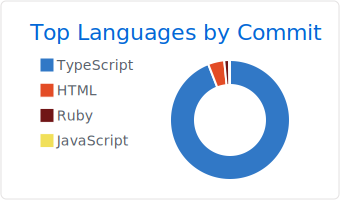
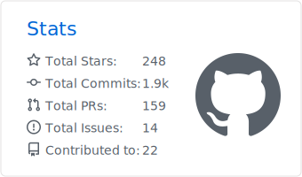
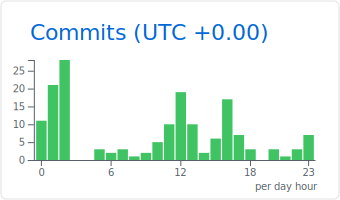
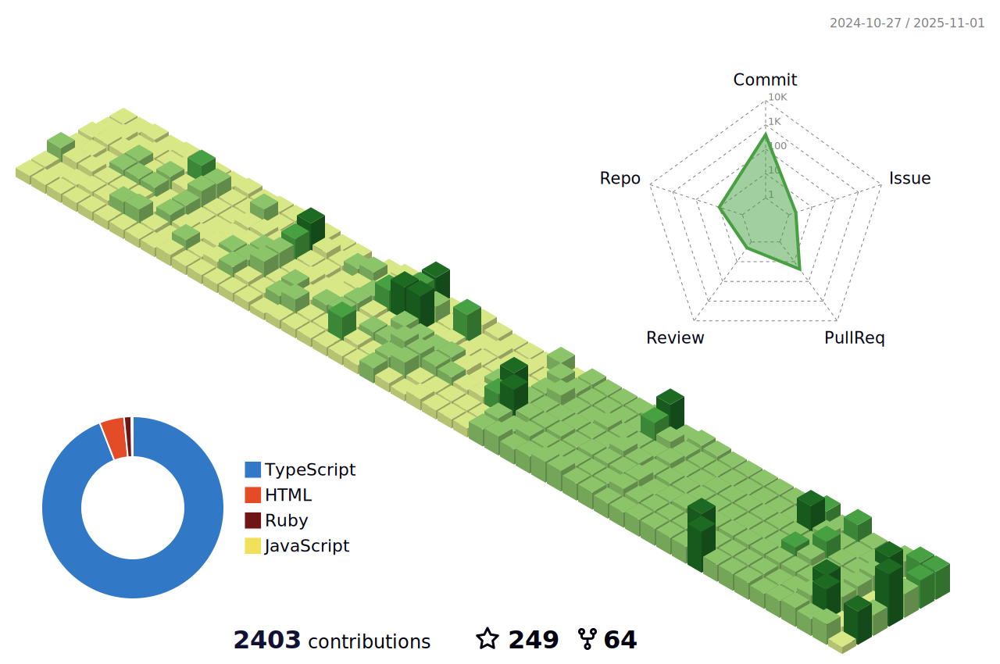

    <h2>Hi there 👋</h2> 
    I'm <b>Jelte Lagendijk</b>, a Software Engineer from The Netherlands.  
    I'm a Full Stack Developer who enjoys building reusable solutions. I'm fun to work with, enjoy coding and using creativity.
Have been doing mostly Front End development in the past, but made the transition to broader stacks since 2022. I enjoy Typescript, <a href="https://nextjs.org/" target="_blank">NextJS</a>, <a href="https://deno.com/" target="_blank">Deno</a>, Serverless technologies and Docker. Huge fan of <a href="https://raycast.com/j3lte" target="_blank">Raycast</a>, I build extensions in my free time (see below).  

  <picture>
    <source media="(prefers-color-scheme: dark)" srcset="./profile-summary-card-output/github_dark/0-profile-details.svg">
    <source media="(prefers-color-scheme: light)" srcset="./profile-summary-card-output/github/0-profile-details.svg">
    
  </picture>

 

  <picture>
    <source media="(prefers-color-scheme: dark)" srcset="./profile-summary-card-output/github_dark/1-repos-per-language.svg">
    <source media="(prefers-color-scheme: light)" srcset="./profile-summary-card-output/github/1-repos-per-language.svg">
    
  </picture>
  <picture>
    <source media="(prefers-color-scheme: dark)" srcset="./profile-summary-card-output/github_dark/2-most-commit-language.svg">
    <source media="(prefers-color-scheme: light)" srcset="./profile-summary-card-output/github/2-most-commit-language.svg">
    
  </picture>

 

  <picture>
    <source media="(prefers-color-scheme: dark)" srcset="./profile-summary-card-output/github_dark/3-stats.svg">
    <source media="(prefers-color-scheme: light)" srcset="./profile-summary-card-output/github/3-stats.svg">
    
  </picture>
  <picture>
    <source media="(prefers-color-scheme: dark)" srcset="./profile-summary-card-output/github_dark/4-productive-time.svg">
    <source media="(prefers-color-scheme: light)" srcset="./profile-summary-card-output/github/4-productive-time.svg">
    
  </picture>

 

  <picture>
    <source media="(prefers-color-scheme: dark)" srcset="./profile-3d-contrib/profile-night-green.svg">
    <source media="(prefers-color-scheme: light)" srcset="./profile-3d-contrib/profile-green-animate.svg">
    
  </picture>

 

  
  
  
  
  
  
  

 
<h3>Raycast:</h3>

<!-- START RAYCAST -->

| Authored | Contributed |
| --- | --- |
| [Anna's Archive `^1.103.6`](https://raycast.com/j3lte/anna-s-archive) | [Brew `^1.103.6`](https://raycast.com/nhojb/brew) [(⚠️1)](https://github.com/raycast/extensions/issues?q=is%3Aissue%20label%3A%22extension%3A%20brew%22%20state%3Aopen) |
| [Composerize `^1.72.1`](https://raycast.com/j3lte/composerize) | [Can I Use `^1.71.1`](https://raycast.com/thomaslombart/can-i-use) |
| [CSS Tricks `^1.79.1`](https://raycast.com/j3lte/css-tricks) | [Capture Fullpage of Website `^1.76.0`](https://raycast.com/Coun1er/capture-fullpage-of-website) |
| [Deno Deploy `^1.93.2`](https://raycast.com/j3lte/deno-deploy) | [ChangeDetection.io `^1.103.10`](https://raycast.com/xmok/changedetection-io) |
| [Evil Insult `^1.76.1`](https://raycast.com/j3lte/evil-insult) | [Country Lookup `^1.99.4`](https://raycast.com/pernielsentikaer/country-lookup) |
| [Exif Viewer `^1.103.3`](https://raycast.com/j3lte/exif) | [DevDocs `^1.103.10`](https://raycast.com/djpowers/devdocs) |
| [Freesound `^1.76.0`](https://raycast.com/j3lte/freesound) | [Dig - DNS Lookup `^1.103.3`](https://raycast.com/danielbahl/dig) |
| [Govee `^1.79.1`](https://raycast.com/j3lte/govee) | [FFmpeg - View, Analyze and Manipulate `^1.103.10`](https://raycast.com/RenderCoder/ffmpeg) |
| [HTTP Observatory `^1.103.3`](https://raycast.com/j3lte/http-observatory) | [Font Awesome `^1.103.3`](https://raycast.com/dutzi/font-awesome) [(⚠️1)](https://github.com/raycast/extensions/issues?q=is%3Aissue%20label%3A%22extension%3A%20font-awesome%22%20state%3Aopen) |
| [JSR `^1.103.5`](https://raycast.com/j3lte/jsr) | [Fotmob `^1.103.0`](https://raycast.com/iamlas/fotmob) |
| [NU Nieuws `^1.71.3`](https://raycast.com/j3lte/nu-nieuws) | [Get SSH Key `^1.100.3`](https://raycast.com/Theon/get-ssh-key) |
| [Password Strength `^1.83.1`](https://raycast.com/j3lte/password-strength) | [GIF Search `^1.93.2`](https://raycast.com/josephschmitt/gif-search) |
| [Substack `^1.71.4`](https://raycast.com/j3lte/substack) | [GitHub `^1.87.0`](https://raycast.com/thomaslombart/github) [(⚠️10)](https://github.com/raycast/extensions/issues?q=is%3Aissue%20label%3A%22extension%3A%20github%22%20state%3Aopen) |
|   | [GitHub Repository Search `^1.79.1`](https://raycast.com/thomas/github-repository-search) |
|   | [Google Calendar `^1.103.0`](https://raycast.com/thomas/google-calendar) [(⚠️6)](https://github.com/raycast/extensions/issues?q=is%3Aissue%20label%3A%22extension%3A%20google-calendar%22%20state%3Aopen) |
|   | [Google Chrome `^1.103.6`](https://raycast.com/Codely/google-chrome) [(⚠️4)](https://github.com/raycast/extensions/issues?q=is%3Aissue%20label%3A%22extension%3A%20google-chrome%22%20state%3Aopen) |
|   | [Heroicons `^1.70.3`](https://raycast.com/johndoe123789/heroicons) |
|   | [HubSpot `^1.99.4`](https://raycast.com/harisvsulaiman/hubspot) |
|   | [IconPark `^1.78.0`](https://raycast.com/koinzhang/iconpark) |
|   | [Jump `^1.63.0`](https://raycast.com/HelloImSteven/jump) |
|   | [JustWatch Search `^1.84.2`](https://raycast.com/rishabswift/search-justwatch) |
|   | [Library Genesis `^1.101.1`](https://raycast.com/yz3440/library-genesis) |
|   | [Mac App Store Search `^1.69.0`](https://raycast.com/say4n/mac-app-store-search) |
|   | [MyIP `^1.102.7`](https://raycast.com/Kang/myip) |
|   | [NATO Phonetic Alphabet `^1.79.1`](https://raycast.com/jns/nato-phonetic-alphabet) |
|   | [OBS Control `^1.79.1`](https://raycast.com/Yukai/obs-control) |
|   | [Open Graph `^1.72.1`](https://raycast.com/1weiho/open-graph) [(⚠️1)](https://github.com/raycast/extensions/issues?q=is%3Aissue%20label%3A%22extension%3A%20open-graph%22%20state%3Aopen) |
|   | [Pixabay `^1.71.4`](https://raycast.com/tonka3000/pixabay) |
|   | [Placeholder `^1.79.1`](https://raycast.com/koinzhang/placeholder) |
|   | [Pomodoro `^1.86.1`](https://raycast.com/asubbotin/pomodoro) [(⚠️2)](https://github.com/raycast/extensions/issues?q=is%3Aissue%20label%3A%22extension%3A%20pomodoro%22%20state%3Aopen) |
|   | [Raindrop.io `^1.102.6`](https://raycast.com/lardissone/raindrop-io) [(⚠️7)](https://github.com/raycast/extensions/issues?q=is%3Aissue%20label%3A%22extension%3A%20raindrop-io%22%20state%3Aopen) |
|   | [Random Data Generator `^1.103.4`](https://raycast.com/loris/random) [(⚠️1)](https://github.com/raycast/extensions/issues?q=is%3Aissue%20label%3A%22extension%3A%20random%22%20state%3Aopen) |
|   | [Search MDN `^1.76.0`](https://raycast.com/krzysztofzuraw/search-mdn) |
|   | [Search npm Packages `^1.103.6`](https://raycast.com/mrmartineau/search-npm) |
|   | [Sonarr `^1.103.5`](https://raycast.com/Aayush9029/sonarr) |
|   | [Tailscale `^1.77.3`](https://raycast.com/samlinville/tailscale) |
|   | [The Movie Database `^1.69.0`](https://raycast.com/Aayush9029/tmdb) |
|   | [TinyPNG `^1.83.1`](https://raycast.com/kawamataryo/tinypng) |
|   | [Transmission `^1.94.0`](https://raycast.com/FezVrasta/transmission) |
|   | [Unicode Symbols Search `^1.103.3`](https://raycast.com/mmazzarolo/unicode-symbols) [(⚠️1)](https://github.com/raycast/extensions/issues?q=is%3Aissue%20label%3A%22extension%3A%20unicode-symbols%22%20state%3Aopen) |
|   | [Wayback Machine `^1.88.4`](https://raycast.com/pernielsentikaer/wayback-machine) |
|   | [Whois `^1.102.3`](https://raycast.com/zavbala/whois) [(⚠️1)](https://github.com/raycast/extensions/issues?q=is%3Aissue%20label%3A%22extension%3A%20whois%22%20state%3Aopen) |
|   | [Wikipedia `^1.79.0`](https://raycast.com/vimtor/wikipedia) [(⚠️1)](https://github.com/raycast/extensions/issues?q=is%3Aissue%20label%3A%22extension%3A%20wikipedia%22%20state%3Aopen) |
|   | [Word Search `^1.84.3`](https://raycast.com/rishabswift/word-search) [(⚠️1)](https://github.com/raycast/extensions/issues?q=is%3Aissue%20label%3A%22extension%3A%20word-search%22%20state%3Aopen) |

<!-- END RAYCAST -->

 
<h3>Contact:</h3>

 

  
  

 

<h3>Personal</h3>
 

  I also do a bit of photography on the side  
  

